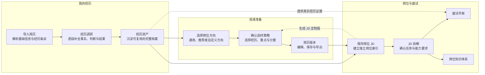

# 职序

> 基于真实经历，生成面向不同岗位的简历与面试材料。

[在线体验](https://job-prep-web.vercel.app/) · [安装 Career Prep Coach Skill](https://github.com/hirclelili/career-prep-coach)

职序是一款本地优先的 AI 求职工作台。

它不是只帮你改一份简历，也不是收到 JD 后临时生成一套标准答案。职序先通过追问把零散、模糊的经历整理成可以长期复用的经历资产，再根据岗位方向或具体 JD 制定选材策略，生成简历版本、面试手册和知识体系。

同一段真实经历只需要认真整理一次，之后可以被用于不同方向的简历和不同岗位的面试准备。

## 为什么做职序

大多数求职工具从“生成一份简历”或“准备一次面试”开始，但真正限制内容质量的通常不是表达，而是经历本身没有被梳理清楚：

- 做过很多事情，却说不清业务问题和个人贡献。
- 简历只有动作，没有判断、方法和结果证据。
- 面试前重新回忆经历，每个岗位都要从头准备。
- 同一份简历投递多个方向，内容没有重点。
- AI 为了补全内容，容易生成未经确认的事实和数据。

职序把“经历”作为所有求职材料的共同事实来源：



实线表示主要使用路径，虚线表示跨模块复用。用户可以跳步，也可以同时维护多段经历、多份简历和多个岗位。

## 核心功能

### 1. 简历导入

- 上传 PDF 简历或直接粘贴文本。
- 解析个人信息、教育背景和经历条目。
- 区分实习经历、独立项目、校园经历等一级类别。
- 导入结果只是原始材料，不会被自动视为已经深挖完成。

### 2. 经历调研

- 针对每一段经历独立保存对话和调研进度。
- 自动识别一段经历中的多个项目或工作模块。
- AI 根据已有内容提供可点击的单选、多选和自由补充选项。
- 持续追问业务背景、个人职责、关键判断、行动过程和结果证据。
- 调研状态来自结构化事实覆盖度，不依赖聊天关键词或消息数量。

### 3. 经历资产

经历调研完成后，会沉淀为可继续阅读和修改的完整档案，包括：

- 经历总览与基础事实
- 各项目的背景、目标和限制
- 详细的个人职责与贡献边界
- 判断、取舍、方案设计、推进和验证过程
- 结果证据与仍需补充的信息
- 可用于简历的 bullet
- 详细面试故事和口述版本

经历资产是后续简历和面试内容的事实来源，不按岗位方向保存多套互相冲突的经历。

### 4. 岗位方向与简历版本

- AI 读取全部经历，根据实际能力证据推荐职业方向，而不只照抄历史岗位名称。
- 支持通用版本、推荐方向、自定义方向和具体 JD 定制。
- 生成简历前先形成选材策略：
  - 哪些经历主打、保留、弱化或排除
  - 每段经历强调什么
  - 每段经历使用多少条 bullet
- 用户可以调整经历选择、顺序、强调角度和内容分量。
- 用户确认策略后才生成完整简历。
- 已生成简历可以继续编辑、局部 AI 优化，并导出 Word、PDF 和 PNG。

方向只改变选材重点和表达方式，不改变经历事实。所有经历在各自一级栏目中仍按时间倒序排列。

### 5. 岗位与 JD

- 保存多个公司和岗位的 JD。
- 自动拆解岗位目标、核心任务、能力要求和潜在面试重点。
- 每个岗位作为独立索引，关联对应的简历版本、面试手册和知识体系。
- 已保存的 JD 默认折叠展示，把主要阅读空间留给生成后的求职材料。

### 6. 面试准备

- 基于当前 JD、简历版本和经历资产生成七章面试手册。
- 预测 15–20 道岗位问题，并区分直接命中、可迁移能力和真实缺口。
- 生成与岗位对应的知识体系：
  - 思维导图
  - 分模块概念说明
  - 应用场景、指标和案例
- 支持补充推荐知识模块，也可以添加自定义模块。
- 面试手册章节和知识体系模块均支持局部重写，确认后再替换原内容。

### 7. AI 助手

全局 AI 助手负责读取当前状态、回答与求职材料相关的问题，并帮助用户找到下一步。

页面内的生成任务仍由对应 Skill 处理。普通聊天不会被强制转换成简历生成或面试手册任务；涉及生成、更新和保存时，也会遵守当前页面的数据和确认规则。

## 使用方式

1. 打开[职序在线版](https://job-prep-web.vercel.app/)。
2. 在右上角设置 AI 服务商、模型和自己的 API Key。
3. 上传 PDF 简历或粘贴简历文本。
4. 从经历资产中选择一段经历开始调研。
5. 根据需要生成岗位方向版简历，或保存具体 JD 继续准备。

目前支持预设服务商和 OpenAI Compatible 自定义接口。模型列表可以从服务商接口读取，也可以手动填写模型 ID。

## 数据与隐私

职序当前不要求注册账号，也没有云端用户数据库。

以下内容默认保存在当前浏览器的 `localStorage` 中：

- 个人基础信息
- 原始简历
- 经历资产和调研进度
- 简历草稿与已保存版本
- 岗位、JD、面试手册和知识体系
- AI 服务商设置和 API Key

这意味着：

- 刷新页面后，已保存数据和主要草稿仍会保留。
- 更换浏览器、设备或使用隐身模式时，数据不会自动同步。
- 清理浏览器网站数据后，本地内容可能消失。
- 重要简历和经历档案建议及时导出或备份。

调用 AI 时，必要的上下文会发送到用户选择的模型服务商。API Key 不会提交到本项目仓库。

## 搜索增强

搜索只服务于岗位相关的简历定制和面试准备，用于补充公司官网、业务背景和同类岗位公开信息。

搜索结果不能替代用户经历事实，也不会被用于虚构个人项目、数据结果或贡献边界。搜索不可用时，主流程会跳过搜索继续运行。

搜索服务仅在部署环境的服务端配置：

```text
SEARCH_PROVIDER=tavily
SEARCH_API_KEY=your_search_api_key
```

`SEARCH_PROVIDER` 支持 `tavily`、`brave` 和 `serper`，默认使用 `tavily`。

## 本地运行

要求：

- Node.js 18+
- npm

```bash
git clone https://github.com/hirclelili/job-prep-web.git
cd job-prep-web
npm install
npm run dev
```

生产构建：

```bash
npm run build
npm run preview
```

`npm run dev` 只启动 Vite 前端，因此会自动跳过服务端搜索。需要本地调试 `/api/search` 时，请使用 Vercel CLI 启动项目，并在本地环境变量中配置搜索服务。

## 技术结构

- React 18
- Vite
- React Router
- Tailwind CSS
- React Markdown
- PDF.js
- Vercel

AI 能力按照业务阶段拆分为独立 Skills，包括简历解析、经历调研、经历档案生成、方向推荐、选材策略、简历生成、JD 拆解、面试手册、知识体系和局部优化。

## Skill 与网页版的关系

[Career Prep Coach](https://github.com/hirclelili/career-prep-coach) 是独立开源的 Agent Skill，适合在 Claude Code、Claude.ai 和 Codex 中安装使用。

网页版提供的是完整产品工作流，包括：

- 经历库、简历版本和岗位库
- 结构化交互与状态管理
- 草稿缓存和本地持久化
- Word、PDF、PNG 导出
- 页面之间的数据关联

两者共享相同的事实安全原则和求职准备方法，但不是彼此运行的前置条件。

## 项目状态

当前版本仍处于早期公开测试阶段，优先保证桌面端体验。功能和数据结构仍会持续调整，建议不要把浏览器本地存储作为唯一备份。

欢迎通过 GitHub Issues 提交：

- 无法完成的操作
- 解析或生成结构错误
- 具体页面的交互问题
- 对经历调研、简历和面试内容质量的反馈

## 许可说明

本仓库当前公开用于产品展示、体验和交流，但**未授予开源许可证**。除法律允许的情形外，未经许可不得复制、修改、再发布或用于商业部署。

独立的开源 Skill 请参见 [hirclelili/career-prep-coach](https://github.com/hirclelili/career-prep-coach)，该项目采用 Apache License 2.0。
